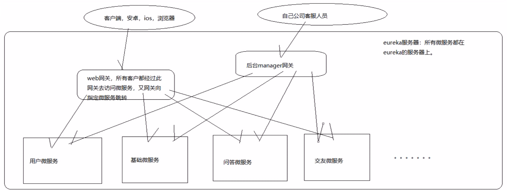

# 网关

## 功能

### 用户网关和后台管理网关

- 安装原项目设计，是需要两个网关的，但是我这里为了简单方便，就只使用一个网关，只需要记住，是可以允许这样的架构出现的

## 问题

### ZuulFilter和HandlerInterceptor

- 他们之间是没有影响的，因为Interceptor是作用域是在Controller层，而zuulfilter和interceptor的作用域是不重叠的
- 我们会看到，访问zuul来路由转发，是不会触发interceptor拦截的

### Zuul登录认证

- ZuulFilter外部请求访问网关时的第一层登录认证，TokenIntercepter，是网关转发，内部服务之间调用的，第二层登录认证。第二层其实可以不要，只是为了更加安全
- ZuulFilter返回response和TokenInterceptor返回response的方式不同，interceptor直接抛出权限不足的异常，交给全局拦截器去返回即可。但是全局拦截去对zuulfilter抛出的异常是不生效的。